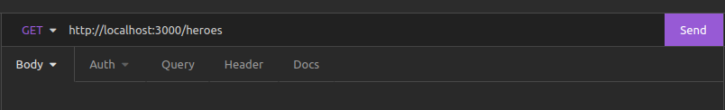
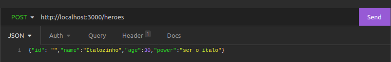
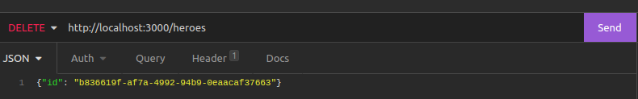

# Building a Node.js WebApi + testing with no frameworks

## Features Checklist

- Web API
    - [x] it should have an endpoint for storing heroes' data
    - [x] it should have an endpoint for retrieving heroes' data
    - [ ] it should have an endpoint for updating heroes' data
    - [x] it should have an endpoint for deleting heroes' data

- Testing
    - Unit
        - [x] it should test all files on the routes layer
        - [ ] it should test all files on the repositories layer
        - [ ] it should test all files on the factories layer
        - [ ] it should reach 100% code coverage. It's currently not possible to get code coverage metrics using only the native Node.js, we will use [c8](https://www.npmjs.com/package/c8).

    - Integration / E2E
        - [x] it should test the endpoint for storing heroes' data
        - [ ] it should test the endpoint for retrieving heroes' data
        - [ ] it should test the endpoint for updating heroes' data
        - [ ] it should test the endpoint for deleting heroes' data

## Command line
_**Node 18.1** required!_

- Clone project
```bash
    git clone git@github.com:PatrickMoraisN/native-nodejs-api-nlayers.git
```

- Start server
```bash
    npm start
```

- Run tests
```bash
    npm test
```

- Run test coverage
```bash
    npm run test:cov
```

---

## Requests
 - base url

    ```bash
    http://localhost:3000/heroes
    ```

---
- GET
    

---
- POST <br>
_*Can pass a custom id, or let create a random uuid*_
    

---
- DELETE
    